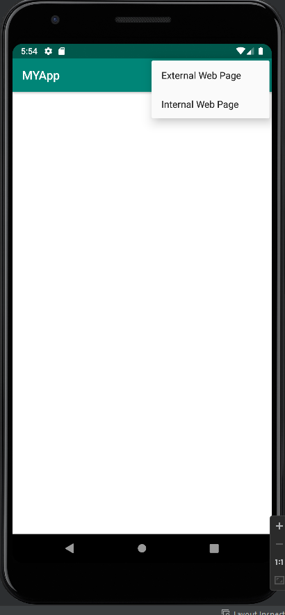

# Rapport

**Skriv din rapport här!**


- Jag har byt min app namn till MYApp i values- strings.xml.
- Jag har aktivera internetåtkomst i AndroidManifest.xml.
- Jag har ändrat TextView till WebView i activity_main.xml. 
- Skapat den WebView till my_webview.
- Och ändrat layout width och height till 0dp. På så sätt kommer skärmen att täcka hela utrymmet under menyraden.
- Jag har skapat en privat myWebView. OCh instansiera det.
- Skapa en ny webviewclient till mywebview.
- Jag har Aktivera Javascript-körning i  WebViewClient.
- Jag har Lägg till en HTML-sida som en tillgång. Heta webb.html. Höger klicka och välja new-> folder-> assets folder. Sen höger klicka assets folder och välja new->file och skriva i .html
- Jag har implementera 'showExternalWebPage()' och 'showInternalWebPage()'.
- Jag har Call 'showExternalWebPage()' och 'showInternalWebPage()'. I mainactivity.java
```
<string name="app_name">MYApp</string>// Byta namn

<uses-permission android:name="android.permission.INTERNET" /> //aktivera internetåtkomst//

<WebView
        android:id="@+id/my_webview"
        android:layout_width="0dp"
        android:layout_height="0dp">
        
private WebView myWebView; //skapa en privat webview//
 myWebView = findViewById(R.id.my_webview); //instansiera med findviewbyid//
        myWebView.setWebViewClient(new WebViewClient()); //Skapa en ny WebViewClient att bifoga till WebView//
        WebSettings webSettings = myWebView.getSettings();
        webSettings.setJavaScriptEnabled(true);//Aktivera Javascript//
        
 public void showExternalWebPage() {myWebView.loadUrl("https://his.se"); } //implementera showExternalWebPage()//
 public void showInternalWebPage(){myWebView.loadUrl("file:///android_asset/webb.html"); }//implementera showInternalWebPage()//
 
 if (id == R.id.action_external_web) {
            showExternalWebPage(); // call showExternalWebPage//
            Log.d("==>","Will display external web page");
            return true;
        }

        if (id == R.id.action_internal_web) {
            showInternalWebPage(); // call showInternalWebPage//
            Log.d("==>","Will display internal web page");
            return true;
        }
```




